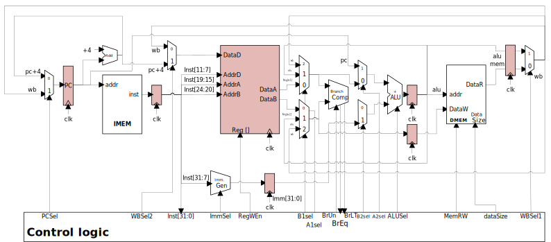

# Miniprojet_RISC_V
**SEI 2A projet semestre 8**

Ce projet de 4e année d'école d'ingénieur consistait à réaliser un processeur *RISC-V* 32 bits en System Verilog. Le processeur devait être capable d'exécuter le jeu d'instruction *RV32I* sans extentions. Le processeur est aussi accompagné d'un compilateur permettant de passer d'un code assembleur *RV32I* à un code machine.

## Architecture
Le processeur adopte une architecture *Harvard*. Il comporte un pipeline 5 étages (Fetch, Decode, Execute, Memory, WriteBack). Il est capable d'exécuter l'ensemble du jeu d'instruction *RV32I* sans extentions à l'exception des instructions suivantes :
- `csrrw`
- `csrrs`
- `csrrc`
- `csrrwi`
- `csrrsi`
- `csrrci`
- `ecall`
- `ebreak`
- `fence`
- `fence.i`

## Description des dossier
- **asic** : Contient les éléments permettant de faire la synthèse du processeur
- **bench** : Contient les bancs de test du processeur. L'avancement des tests se trouve dans le fichier [TODO.md](bench/TODO.md)
- **compilateur** : Contient le sous projet du compilateur décrit dans la partie [Compilateur RV32I](#compilateur-rv32i)
- **config** : Contient les fichiers de configuration pour ModelSim les outils de synthèse
- **doc** : Contient l'ensemble de la documentation du projet
- **prog** : Contient les programmes de test du processeur. Le descriptif de chaque programme se trouve dans le fichier [description_tests.md](prog/description_tests.md)
- **rtl** : Contient le code source du processeur
- **winconfig** : Contient les fichiers de configuration pour ModelSim sous Windows

## Utilisation
Pour simuler le processeur sous Windows avec ModelSim et avec le bench principal il suffit d'exécuter le script [`rtl/wincompile_System_Verilog.bat.bat`](rtl/wincompile_System_Verilog.bat) qui va lancer ModelSim et exécuter le testbench `bench/bench_riscv.sv`. Il est possible de changer le testbench à exécuter en modifiant le fichier de script comme suit :
- A la ligne **6** définir le chemin vers le dossier contenant le projet
    ```batch
    set PROJECT_PATH=Chemin/vers/le/dossier/contenant/le/projet
    ```
- A la ligne **14** définir les fichier RTL à compiler
    ```batch
    set RTL_FILE[0]=fichier1.sv
    set RTL_FILE[1]=fichier2.sv
    ...
    ```
    > **Note :** Il est possible de compiler tous les fichiers RTL en même temps comme suit
    > ```batch
    > set RTL_FILE[0]=*.sv
    > ```
- A la ligne **17** définir le testbench à compiler
    ```batch
    set BENCH_FILE[0]=fichier1.sv
    set BENCH_FILE[1]=fichier2.sv
    ...
    ```
    > **Note :** De même, il est possible de compiler tous les fichiers RTL en même temps comme suit
    > ```batch
    > set BENCH_FILE[0]=*.sv
    > ```
- **Important** : Il est nécessaire modifier le nombre de fichier à compiler aux lignes **59** et **60**
    ```batch
    for /l %%i in (0,1,NB_FICHIER) do call :display "!RTL_FILE[%%i]!"  %RTL_PATH%
    for /l %%i in (0,1,NB_FICHIER) do call :display "!BENCH_FILE[%%i]!" %BENCH_PATH%
    ```
- A la ligne **66** définir le testbench à exécuter et le script de début de bench à exécuter
    ```batch
    vsim -voptargs=+acc -do "do {%PROJECT_PATH%/%BENCH_PATH%/SCRIPT DE DEBUT DE BENCH}" LIB_Miniproj_RISCV.BENCH_A_EXECUTER
    ```
    > **Note :** Mettre le nom du module du testbench à exécuter à la place de `BENCH_A_EXECUTER` et non pas le nom du fichier

## Avancement
La plupart des instructions sont fonctionnelles. Il reste cependant un certains nombre de problèmes empêchant l'exécution du programme de test principal. Ce dernier valide :
- [x]  L'écriture dans les registres
- [x]  La lecture des registres
- [x]  L'écriture dans la mémoire
- [x]  La plupart des opération arithmétiques (immédiates ou depuis les registres)

Il semble qu'au stade actuel du projet la lecture dans la mémoire ne fonctionne pas correctement. Cela empêche donc l'exécution correcte du reste des tests.

Cependant l'ensembles des autres tests réalisés sont fonctionnels.

## Compilateur RV32I
Afin de pouvoir réaliser nos testbench, nous avons eu besoin de réaliser un compilateur permettant de passer d'un code assembleur *RV32I* à un code machine. Pour cela nous avons réulitliser le compilateur réaliser lors du projet d'informatique du semestre 7.

### Usage
Pour compiler un fichier assembleur, il suffit de suivre la syntaxe suivante :
```
rv32icomp.exe source_file regexps_file binfile [-v]
```
| Syntax | Description |
|---------------|--------------------|
| `source_file` | Code source à lire |
| `regexps_file` | Fichier contenant la syntaxe souhaitée (il est recommandé d'utiliser le fichier `database.txt`) |
| `binfile` | Nom du fichier binaire à générer |
| `-v` | Affiche la progression du parsing |

### Fonctionnalités
Le compilateur est capable de compiler tous le jeu d'instruction *RV32I* sans extentions à l'exception des instructions suivantes :
- `csrrw`
- `csrrs`
- `csrrc`
- `csrrwi`
- `csrrsi`
- `csrrci`
- `ecall`
- `ebreak`
- `fence`
- `fence.i`

Le compilateur est capable de compiler les instructions suivantes n'étant pas pris en charge par le processeur cible :
- `j` remplacé par `jal r6,offset`
- `li` remplacé par `addi rd,zero,imm`
- `mv` remplacé par `add rd,rs1,zero`
- `ble` (pas encore supporté)

Le compilateur ajoute aussi automatiquement deux instructions `NOP` après chaque instruction de branchement.

Enfin il fait reboucler automatiquement le programme sur lui même à la fin du code source.

### Compilation
Il est possible de compiler un exécutable sous Windows via **MinGW** en exécutant `wincompile.bat` ou sous Linux via *WSL* en exécutant `compile.bat`.
Les deux scripts génèrent un exécutable nommé `rv32icomp.exe` dans le dossier `bin`, et l'exécute avec des du code de test sous valgrind pour `compile.bat`.

Sous linux il est possible de compiler le compilateur en utilisant la commande `make`, **cependant le makefile n'a pas été testé depuis la mise à jour du projet**.

### Limitations
Le compilateur n'a pas été entièrement testé, il est possible qu'il ne fonctionne pas correctement sur certains fichiers. 
